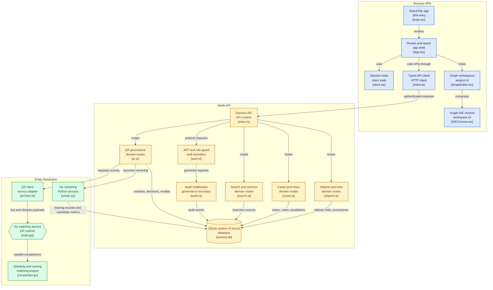

# SENTINEL

**SENTINEL** is an investigative intelligence, link analysis, and entity resolution platform purpose-built for counter-human-trafficking operations. Inspired by intelligence-grade link-analysis systems, SENTINEL enables investigators, intelligence analysts, and data stewards to ingest, link, analyze, and resolve disparate entities—individuals, organizations, locations, phone numbers, job listings, and evidentiary documents—across complex cross-border trafficking networks without baking premature conclusions into data schemas.

---

## Architecture Overview

SENTINEL employs a multi-tier microservices architecture engineered for high concurrency, operational compliance, and human-in-the-loop governance:



---

## Key Capabilities

### 1. Interactive Graph Intelligence & Graph IDE
- **Force-Directed Network Visualization**: D3-powered canvas representing entities as nodes and relationships as weighted edges, with dynamic filtering by classification, confidence, and predicate type.
- **Graph IDE Workspace (`/graph/editor`)**: Visual graph manipulation suite with:
  - **Minimap**: Real-time canvas radar with interactive pan and click-to-center navigation.
  - **Command Palette (`⌘K` / `Ctrl+K`)**: Rapid search across entities, tools, and actions with keyboard navigation.
  - **Outliner Tree**: Grouping of case members by entity type with instant text filtering.
  - **Spatial Auto-Layout (`⌘⇧A`)**: Multi-force collision-avoiding force layout calculation.
  - **Multi-Selection Marquee & Clipboard**: Copy (`⌘C`), Cut (`⌘X`), and Paste (`⌘V`) nodes across cases.
  - **Undo / Redo Stack (`⌘Z` / `⌘⇧Z`)**: Full historical tracking of spatial movements and graph alterations.
  - **Add Object at Cursor (`Shift+A`)**: Instant in-place node creation and insertion.
  - **Curved Bezier Routing**: Edge routing that calculates rectangle perimeter exit points to avoid node overlap.
- **Entity Dossiers & Evidence Popovers**: Granular entity inspection cards showing structured metadata, property history, associated case files, intelligence notes, provenance records, and incoming/outgoing links.

### 2. Entity Resolution (ER) Engine (Go Microservice)
- **High-Performance Parallel Matching**: Standalone Go microservice listening on `:3002` executing concurrent pairwise entity comparisons across CPU cores (`runtime.NumCPU()`).
- **Multi-Attribute Similarity Scoring**:
  - **Person Matching**: Unicode-safe Jaro-Winkler string similarity, phonetic Soundex encoding, normalized phone matching, location proximity, and alias resolution.
  - **Organization Matching**: Registration identifier matching, address proximity, and high/medium Jaro-Winkler name analysis.
  - **Phone & Location Matching**: Normalized E.164 and localized digit matching; normalized address string comparison.
- **Human-in-the-Loop ER Review (Data Steward Authority)**: Flagged pairwise matches with similarity scores, matched attributes, and confidence levels queued for review (`/entity-resolution/review`). Resolution authority resides with the **Data Steward**, requiring explicit verification of both evidence packages before confirming a merge or keeping records separate.

### 3. Model Registry & Active Learning Retraining Pipeline
- **Decision Logging**: When Data Stewards resolve ER matches (merge or reject), the exact pairwise feature vectors (`jaro_winkler`, `soundex_match`, `exact_phone`, `partial_phone`, `same_city`, `alias_match`, etc.) are automatically logged to `er_training_log`.
- **Logistic Regression Retraining (`retrain.py`)**:
  - Once at least 30 labeled review decisions are collected (minimum 5 merged, 5 rejected), Stewards can trigger model retraining directly from the **Model Registry** (`/model-registry`).
  - Retraining executes an isolated Python process using `scikit-learn` `LogisticRegression` with `StratifiedShuffleSplit` and balanced class weighting.
  - Computes optimal model intercept, feature coefficients, and validation metrics: **Precision**, **Recall**, and **F1 Score**.
- **Shadow Scoring & Evaluation**:
  - Newly trained models enter as `candidate` versions.
  - During live ER sweeps, the backend dispatches both `live_weights` and `shadow_weights` to the Go ER engine.
  - Candidate predictions are logged to `shadow_scores` without impacting live operations, computing real-world average confidence deltas (`avg_delta`).
- **Model Lifecycle Governance**:
  - **Candidate Promotion**: Stewards can review weight diffs against live baselines, inspect shadow evaluation scores, provide a mandatory stated audit purpose, and promote candidates to `live`.
  - **Model Rejection**: Archive underperforming candidate models.
  - **Instant Rollback**: Instantly revert a live model to the previous archived baseline with logged justification.

### 4. Case Management, Governance & Two-Person Escalation
- **Dossier & Investigation Tracking**: Case files with status workflows (`Open`, `Under Review`, `Escalated`, `Closed`) and assigned lead investigators.
- **Two-Person Escalation Gate**: A structural governance safeguard preventing unilateral external handoffs:
  1. An investigator or analyst proposes an escalation to a registered partner agency (e.g., Anti-Trafficking Unit).
  2. Case status is locked to `Under Review`.
  3. Escalation can only be resolved by a designated Case Lead or Steward, who must explicitly approve or deny with logged justification before any dossier is shared externally.
- **Investigation Signals & Safeguards**: Cases aggregate heuristic signals (e.g., shared phone numbers, closed-loop organization paths, repeated listing phrasing) with point weights. Governed by the mandatory investigative disclaimer:
  > *"This is not a probability of trafficking. It reflects why this cluster of objects became interesting."*
- **Analyst Scoping & Field Notes**: Role-based access control ensuring analysts only access cases explicitly assigned to them, with timestamped intelligence notes attached to investigations.

### 5. Data Entry & Ingestion Console (`/data-entry`)
- **Multi-Tab Data Ingestion**: Form interface for registering the core v1 ontology types: `Person`, `Organization`, `Location`, `Phone`, `JobListing`, and `Document` (evidence containers for provenance tracking).
- **Evidentiary Relationship Creation**: Connect entities using strictly neutral, observational predicates (`uses`, `associated_with`, `registered_at`, `listed_by`, `posted_by`, `linked_to`) alongside confidence scores, extraction methods (deterministic vs. probabilistic), and source attribution.
- **Source Registration**: Register intelligence feeds, law enforcement tips, field reports, and telecommunications records with legal bases and data classifications (`Public`, `Internal`, `Restricted`, `Highly Restricted`).
- **On-Demand ER Trigger**: Trigger full-corpus entity resolution sweeps directly from the ingestion workspace.

### 6. Security, RBAC & Purpose-Bound Audit Trail
- **Two-Factor Authentication**: Local credential authentication with MFA token issuance and verification (`123456`, `654321`, `111111`, `999999`), including brute-force protection (5 failed attempt lockout).
- **Role-Based Access Control (RBAC)**: Enforced roles across endpoints:
  - `Analyst`: View, create, link entities within assigned cases, and propose case escalations.
  - `Case Lead`: Manage case teams, author case notes, and review/approve escalation proposals.
  - `Steward`: Source registration, data governance, Model Registry management, and ER review & resolution authority.
  - `Admin`: User administration, system configuration, and complete audit oversight.
  - `Auditor`: Independent oversight and compliance review.
- **Purpose-Bound Audit Trail**: Non-repudiable audit logging capturing actor, action (`READ`, `WRITE`, `MERGE`, `ESCALATE`, `EXPORT`, `RETRAIN`, `MODEL_PROMOTE`, `MODEL_REJECT`, `MODEL_ROLLBACK`), reference, result, timestamp, and crucially a **mandatory stated investigative purpose** (`purpose`) for compliance verification.
- **Audit Log Explorer (`/audit-log`)**: Filterable by action type, actor, date ranges, and pagination.

---

## File and Folder Structure

```
Sentinel/
├── package.json               # Root scripts (dev:all, dev:api, dev:er, dev, build) & dependencies
├── index.html                 # Single-page application HTML entrypoint
├── vite.config.ts             # Vite build & development server configuration
├── tsconfig.json              # TypeScript root configuration
├── tsconfig.node.json         # TypeScript configuration for Node tools
├── er-service-bin             # Precompiled Go Entity Resolution microservice binary
│
├── er-service/                # Entity Resolution Microservice (Go 1.23+)
│   ├── go.mod                 # Go module definition (sentinel/er-service)
│   ├── main.go                # HTTP server (:3002), parallel pairwise worker pool, /match, /weights, /health
│   └── matching/
│       ├── algorithms.go      # Pure Go Jaro-Winkler, Soundex, and phone normalization routines
│       └── comparator.go      # Type-dispatched entity comparison & score calculation logic (rule & logistic)
│
├── backend/                   # Core Backend API Service (Node.js & TypeScript)
│   ├── package.json           # Backend dependencies (Express, jsonwebtoken, dotenv, etc.)
│   ├── tsconfig.json          # Backend TypeScript compiler settings
│   ├── .env                   # Environment config (PORT=3001, ER_SERVICE_URL, JWT_SECRET, DB_PATH)
│   ├── sentinel.db            # SQLite database file (WAL mode, foreign keys enabled)
│   └── src/
│       ├── index.ts           # Express server entrypoint (:3001), CORS, route registration & DB boot
│       ├── auth/
│       │   └── jwt.ts         # JWT generation, verification, session and MFA token management
│       ├── db/
│       │   ├── connection.ts  # Node 22/26 node:sqlite DatabaseSync connection & schema definitions
│       │   └── seed.ts        # Idempotent seed data for initial setup (sample trafficking network)
│       ├── middleware/
│       │   ├── auth.ts        # requireAuth and requireRole RBAC middleware factories
│       │   └── audit.ts       # Response-intercepting audit logger recording to SQLite audit_log
│       ├── routes/
│       │   ├── auth.ts        # Authentication routes (/login, /mfa, /logout)
│       │   ├── objects.ts     # Entity CRUD, filtering, property updates, and link querying
│       │   ├── cases.ts       # Case management, escalation gates, signals, and case-entity links
│       │   ├── links.ts       # Relationship authoring and deletion
│       │   ├── notes.ts       # Investigation note creation and retrieval
│       │   ├── er.ts          # ER candidate review, match runs, retraining, and Model Registry
│       │   ├── sources.ts     # Data source registration and retrieval
│       │   ├── audit.ts       # Querying audit trail entries (Auditor / Admin only)
│       │   └── search.ts      # Multi-entity text search endpoint
│       └── services/
│           ├── erClient.ts    # HTTP client orchestrating payload exchange and shadow scoring with Go ER
│           └── retrain.py     # Python ML script (scikit-learn logistic regression)
│
└── src/                       # Frontend Application (React 19, TypeScript, D3)
    ├── main.tsx               # React application DOM root
    ├── App.tsx                # Client-side router, authentication gate, and layout root
    ├── types.ts               # Shared frontend TypeScript interfaces and type definitions
    ├── api/                   # Typed API client services
    │   ├── client.ts          # Fetch wrapper handling Bearer token injection and error handling
    │   ├── auth.ts            # Authentication API requests
    │   ├── objects.ts         # Entity API requests
    │   ├── cases.ts           # Case management API requests
    │   ├── links.ts           # Relationship API requests
    │   ├── notes.ts           # Notes API requests
    │   ├── er.ts              # Entity resolution & Model Registry API requests
    │   ├── sources.ts         # Data source API requests
    │   ├── audit.ts           # Audit log API requests
    │   └── search.ts          # Search API requests
    ├── config/
    │   └── application.ts     # Global policy constants (timeouts, graph styling, thresholds)
    ├── data/
    │   └── mock.ts            # Fallback fixtures and formatting helpers
    ├── features/              # Feature-specific components
    │   ├── ManualEntryModal.tsx # Rapid entity manual entry modal
    │   ├── shared.tsx         # Shared feature widgets
    │   └── graph-ide/         # Graph IDE Suite
    │       ├── IDEChrome.tsx  # Minimap, Outliner, Command Palette, Theme toggle
    │       ├── AddObjectMenu.tsx # Radial/Context menu for object instantiation
    │       ├── shortcuts.tsx  # Centralized keyboard shortcuts registry & hooks
    │       └── graph-ide.css  # Dark & light theme styles for the IDE
    ├── pages/                 # Full-page view components
    │   ├── Auth.tsx           # Login, MFA verification, and password reset interfaces
    │   ├── Dashboard.tsx      # System overview, key metrics, alerts, and recent activity
    │   ├── Cases.tsx          # Case files, priority queues, briefs, evidence, timeline, signals
    │   ├── Graph.tsx          # D3-based link analysis canvas and entity inspector
    │   ├── GraphEditor.tsx    # Interactive Graph IDE canvas with spatial auto-arrange & minimap
    │   ├── DataEntry.tsx      # Multi-tab data entry console (Objects, Links, Cases, Sources, ER)
    │   ├── ErReview.tsx       # Entity Resolution review queue and merge/dismiss workspace
    │   ├── ModelRegistry.tsx  # Model version registry, retrain controls, weight diffs, rollback
    │   ├── DataSources.tsx    # Ingested intelligence source feed registry & pipelines
    │   ├── ObjectDetail.tsx   # Detailed single-entity dossier view
    │   ├── Search.tsx         # Global multi-attribute entity search
    │   ├── Audit.tsx          # Compliance and security audit log table
    │   └── Settings.tsx       # User preferences, workspace settings, accessibility, and security
    ├── state/
    │   └── store.tsx          # React Context store managing application state & user sessions
    ├── styles/                # Global style sheets and CSS design system
    │   ├── global.css         # Typography, reset, layout, and theme tokens
    │   └── ui.css             # Component styles
    └── ui/                    # Reusable UI component library (primitives, cards, modals, badges)
        ├── primitives.tsx     # Buttons, Modals, Badges, Tabs, Inputs
        └── AppShell.tsx       # Global application shell, navigation sidebar, and topbar
```

---

## API Reference (v1)

All endpoints under `/api/v1` require `Authorization: Bearer <token>`.

### Authentication (`/api/auth`)
| Method | Endpoint | Description |
|---|---|---|
| `POST` | `/api/auth/login` | Authenticate with email and password; returns temporary `mfa_token`. |
| `POST` | `/api/auth/mfa` | Verify 6-digit MFA code with `mfa_token`; returns JWT session token and user profile. |
| `POST` | `/api/auth/logout` | Invalidate current session. |

### Entities & Knowledge Graph (`/api/v1/objects`)
| Method | Endpoint | Description |
|---|---|---|
| `GET` | `/api/v1/objects` | Query entities with optional `?type=` and search query `?q=`. |
| `POST` | `/api/v1/objects` | Ingest new entity object (Analyst, Steward, Admin). |
| `GET` | `/api/v1/objects/:id` | Get entity dossier by ID. |
| `PATCH` | `/api/v1/objects/:id` | Update entity display label or properties. |
| `GET` | `/api/v1/objects/:id/links` | Retrieve all incoming and outgoing links for an entity. |
| `GET` | `/api/v1/objects/:id/provenance` | Retrieve field-level provenance records for an entity. |

### Relationships (`/api/v1/links`)
| Method | Endpoint | Description |
|---|---|---|
| `GET` | `/api/v1/links` | Query relationships with optional `?from=` and `?to=`. |
| `POST` | `/api/v1/links` | Create a directional link with predicate, confidence, and method. |
| `DELETE` | `/api/v1/links/:id` | Remove a relationship from the graph. |

### Cases & Governance (`/api/v1/cases`)
| Method | Endpoint | Description |
|---|---|---|
| `GET` | `/api/v1/cases` | List cases scoped to current user's role and assignments. |
| `POST` | `/api/v1/cases` | Open a new investigation case. |
| `GET` | `/api/v1/cases/:id` | Get full case dossier, assigned team, and entity IDs. |
| `PATCH` | `/api/v1/cases/:id` | Update case title or status (`Open`, `Under Review`, `Closed`). |
| `POST` | `/api/v1/cases/:id/objects` | Add entity to case object collection. |
| `DELETE` | `/api/v1/cases/:id/objects/:objId` | Remove entity from case object collection. |
| `POST` | `/api/v1/cases/:id/escalate` | Propose external handoff to agency (locks case to `Under Review`). |
| `POST` | `/api/v1/cases/:id/escalate/resolve` | Approve or deny escalation with justification (Steward, Admin). |
| `GET` | `/api/v1/cases/:id/signals` | Retrieve heuristic risk indicators and point values for the case. |
| `POST` | `/api/v1/:caseId/notes` | Append a timestamped intelligence note to a case. |

### Entity Resolution & Model Registry (`/api/v1/er`)
| Method | Endpoint | Description |
|---|---|---|
| `GET` | `/api/v1/er/matches` | Retrieve pending ER match pairs ordered by confidence. |
| `GET` | `/api/v1/er/matches/:id` | Get single ER match pair details. |
| `POST` | `/api/v1/er/matches/:id/resolve` | Resolve match (`merge: true/false`); logs to `er_training_log` (Steward, Admin). |
| `POST` | `/api/v1/er/run` | Trigger full-corpus pairwise ER matching sweep via Go microservice. |
| `POST` | `/api/v1/er/retrain` | Train new logistic regression candidate model using Python engine (Steward, Admin). |
| `GET` | `/api/v1/er/model-registry` | List all versioned models with status (`live`, `candidate`, `archived`) and metrics. |
| `GET` | `/api/v1/er/model-registry/:id` | Retrieve model details including shadow evaluation deltas. |
| `POST` | `/api/v1/er/model-registry/:id/promote` | Promote candidate model to live (requires stated purpose). |
| `POST` | `/api/v1/er/model-registry/:id/reject` | Reject candidate model and mark as archived. |
| `POST` | `/api/v1/er/model-registry/:id/rollback` | Revert live model to previous archived version (requires stated purpose). |

### Data Sources (`/api/v1/sources`)
| Method | Endpoint | Description |
|---|---|---|
| `GET` | `/api/v1/sources` | List all registered intelligence and evidence feeds. |
| `POST` | `/api/v1/sources` | Register a new data feed with classification and legal basis (Steward, Admin). |
| `GET` | `/api/v1/sources/:id` | View data feed statistics, ingestion counts, and sync history. |

### Compliance Audit (`/api/v1/audit`)
| Method | Endpoint | Description |
|---|---|---|
| `GET` | `/api/v1/audit` | Query non-repudiable audit logs with filtering (Auditor, Admin). |
| `GET` | `/api/v1/audit/agencies` | List registered external law enforcement and NGO partner agencies. |
| `GET` | `/api/v1/audit/users` | List system users for assignment and audit inspection. |

---

## Seed Data & Demo Accounts

The platform automatically seeds an idempotent counter-trafficking scenario on first boot (a Mumbai/Pune recruitment network involving fraudulent job listings, shared phone infrastructure, and registered shell companies).

Any password with **8 or more characters** is accepted (e.g., `sentinel123`). Any of the following MFA codes are valid: `123456`, `654321`, `111111`, `999999`.

| Name | Email | Role | Permissions / Responsibilities |
|---|---|---|---|
| **Maya Rao** | `maya@sentinel.local` | `analyst` | Case analysis, link authoring, notes, proposing escalations. |
| **Priya Shah** | `priya@sentinel.local` | `steward` | Data ingestion, ER match resolution, Model Registry, escalation approval. |
| **Devraj Mehta** | `devraj@sentinel.local` | `case_lead` | Case team leadership, case reviews, escalation management. |
| **Farah Khan** | `farah@sentinel.local` | `auditor` | Compliance monitoring, non-repudiable audit log oversight. |
| **Admin** | `admin@sentinel.local` | `admin` | Full system administration, user management, global oversight. |

---

## Keyboard Shortcuts (Graph IDE)

| Shortcut | Action | Description |
|---|---|---|
| `⌘K` / `Ctrl+K` | **Command Palette** | Open global search across objects and actions. |
| `Shift+A` | **Add Node** | Open the entity creation menu at cursor location. |
| `⌘C` / `Ctrl+C` | **Copy** | Copy selected graph nodes to clipboard. |
| `⌘X` / `Ctrl+X` | **Cut** | Cut selected graph nodes from current case. |
| `⌘V` / `Ctrl+V` | **Paste** | Paste nodes into active canvas layout. |
| `⌘Z` / `Ctrl+Z` | **Undo** | Revert last graph movement or alteration. |
| `⌘⇧Z` / `Ctrl+Shift+Z` | **Redo** | Replay last undone action. |
| `⌘⇧A` / `Ctrl+Shift+A` | **Auto-Arrange** | Run D3 force simulation to untangle node layout. |
| `F` | **Zoom to Fit** | Center and scale viewport to enclose all nodes. |
| `0` | **Reset Zoom** | Reset zoom scale to 100%. |
| `+` / `=` | **Zoom In** | Step zoom in. |
| `-` | **Zoom Out** | Step zoom out. |

---

## Running the Platform

### Prerequisites
- **Node.js**: v22+ (v26 recommended for native `node:sqlite`)
- **Go**: 1.23+ (only required if modifying/recompiling `er-service`; precompiled binary `er-service-bin` included)
- **Python**: 3.10+ with `scikit-learn` and `numpy` (for ER model retraining):
  ```bash
  pip install scikit-learn numpy
  ```

### Quick Start (All Services)
To start the Go Entity Resolution microservice (`:3002`), the Node.js API backend (`:3001`), and the Vite frontend dev server (`:5173`) concurrently:

```bash
npm run dev:all
```

Access the application in your browser at `http://localhost:5173`.

### Starting Services Individually

1. **Go Entity Resolution Microservice** (`:3002`):
   ```bash
   npm run dev:er
   # Or build and run directly from source:
   cd er-service && go run main.go
   ```

2. **Core Backend API** (`:3001`):
   ```bash
   npm run dev:api
   # Or with nodemon:
   cd backend && npm run dev
   ```

3. **Frontend Application** (`:5173`):
   ```bash
   npm run dev
   ```

### Building for Production
To type-check and generate production client bundles:

```bash
npm run build
```
The optimized static build will be output to `./dist`.
